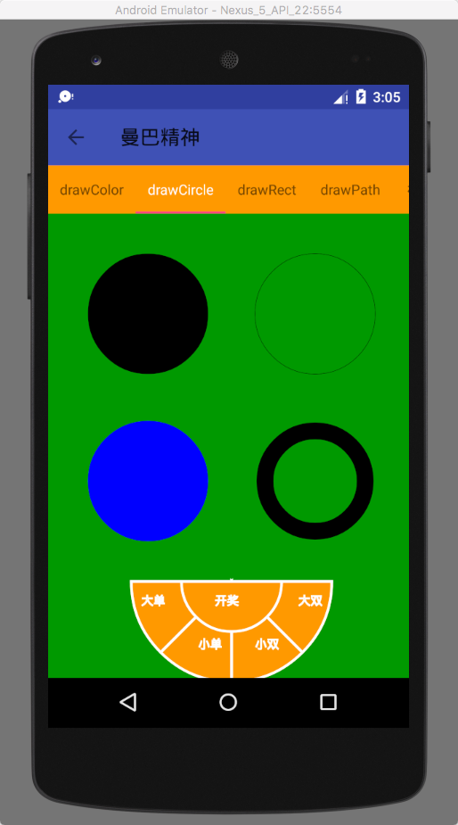

# MyPracticeDraw
看过来，抛物线大神带你一起进阶高级Aandroid开发工程师。第一章自定义view。。。

## 先来几张效果图：

## 自定义View的关键点：

   ### 1. 自定义绘制的方式是重写绘制方法，其中最常用的是 onDraw()

   ### 2. 绘制的关键是 Canvas 的使用

        Canvas 的绘制类方法： drawXXX() （关键参数：Paint）

        Canvas 的辅助类方法：范围裁切和几何变换

   ### 3. 可以使用不同的绘制方法来控制遮盖关系

---
 ## 自定义绘制的上手非常容易：提前创建好 Paint 对象，重写 onDraw()，把绘制代码写在 onDraw() 里面，就是自定义绘制最基本的实现。大概就像这样：

  Paint paint = new Paint();

  @Override

  protected void onDraw(Canvas canvas) {

      super.onDraw(canvas);    // 绘制一个圆

      canvas.drawCircle(300, 300, 200, paint);
      kobe.jpg
  }

  ### Canvas.drawColor(@ColorInt int color) 颜色填充
        这是最基本的 drawXXX() 方法：在整个绘制区域统一涂上指定的颜色。

  ### drawCircle(float centerX, float centerY, float radius, Paint paint) 画圆
        前两个参数 centerX centerY 是圆心的坐标，第三个参数 radius 是圆的半径，单位都是像素，
        它们共同构成了这个圆的基本信息（即用这几个信息可以构建出一个确定的圆）；第四个参数paint
        它提供基本信息之外的所有风格信息，例如颜色、线条粗细、阴影等

  ### drawRect(float left, float top, float right, float bottom, Paint paint) 画矩形
        left, top, right, bottom 是矩形四条边的坐标

  ### rawPoint(float x, float y, Paint paint) 画点
           x 和 y 是点的坐标。点的大小可以通过 paint.setStrokeWidth(width) 来设置；点的形状可以通过 paint.setStrokeCap(cap)
           来设置：ROUND 画出来是圆形的点，SQUARE 或 BUTT 画出来是方形的点。

  ### drawPoints(float[] pts, int offset, int count, Paint paint) / drawPoints(float[] pts, Paint paint) 画点（批量）
            它和 drawPoint() 的区别是可以画多个点。pts 这个数组是点的坐标，每两个成一对；offset 表示跳过数组的前几个数再开始记坐标；
            count 表示一共要绘制几个点。

  ### drawOval(float left, float top, float right, float bottom, Paint paint) 画椭圆
            只能绘制横着的或者竖着的椭圆，不能绘制斜的（斜的倒是也可以，但不是直接使用 drawOval()，而是配合几何变换，后面会讲到）。left,
             top, right, bottom 是这个椭圆的左、上、右、下四个边界点的坐标

   ### drawLine(float startX, float startY, float stopX, float stopY, Paint paint) 画线
            startX, startY, stopX, stopY 分别是线的起点和终点坐标

   ### drawLines(float[] pts, int offset, int count, Paint paint) / drawLines(float[] pts, Paint paint) 画线（批量）
            drawLines() 是 drawLine() 的复数版。

    ### drawRoundRect(float left, float top, float right, float bottom, float rx, float ry, Paint paint) 画圆角矩形
            left, top, right, bottom 是四条边的坐标，rx 和 ry 是圆角的横向半径和纵向半径

    ### drawArc(float left, float top, float right, float bottom, float startAngle, float sweepAngle, boolean useCenter, Paint paint) 绘制弧形或扇形
            drawArc() 是使用一个椭圆来描述弧形的。left, top, right, bottom 描述的是这个弧形所在的椭圆；startAngle 是弧形的起始角度（x 轴的正向，即正右的方向，是 0 度的位置；
            顺时针为正角度，逆时针为负角度），sweepAngle 是弧形划过的角度；useCenter 表示是否连接到圆心，如果不连接到圆心，就是弧形，如果连接到圆心，就是扇形

    ### drawPath(Path path, Paint paint) 画自定义图形
            当你要绘制的图形比较特殊，使用前面的那些方法做不到的时候，就可以使用 drawPath() 来绘制。

    ### drawBitmap(Bitmap bitmap, float left, float top, Paint paint) 画 Bitmap
            绘制 Bitmap 对象，也就是把这个 Bitmap 中的像素内容贴过来。其中 left 和 top 是要把 bitmap 绘制到的位置坐标

     ### drawText(String text, float x, float y, Paint paint) 绘制文字
            界面里所有的显示内容，都是绘制出来的，包括文字。 drawText() 这个方法就是用来绘制文字的。参数 text 是用来绘制的字符串，x 和 y 是绘制的起点坐标。
            Paint.setTextSize(float textSize)可以设置文字的大小

